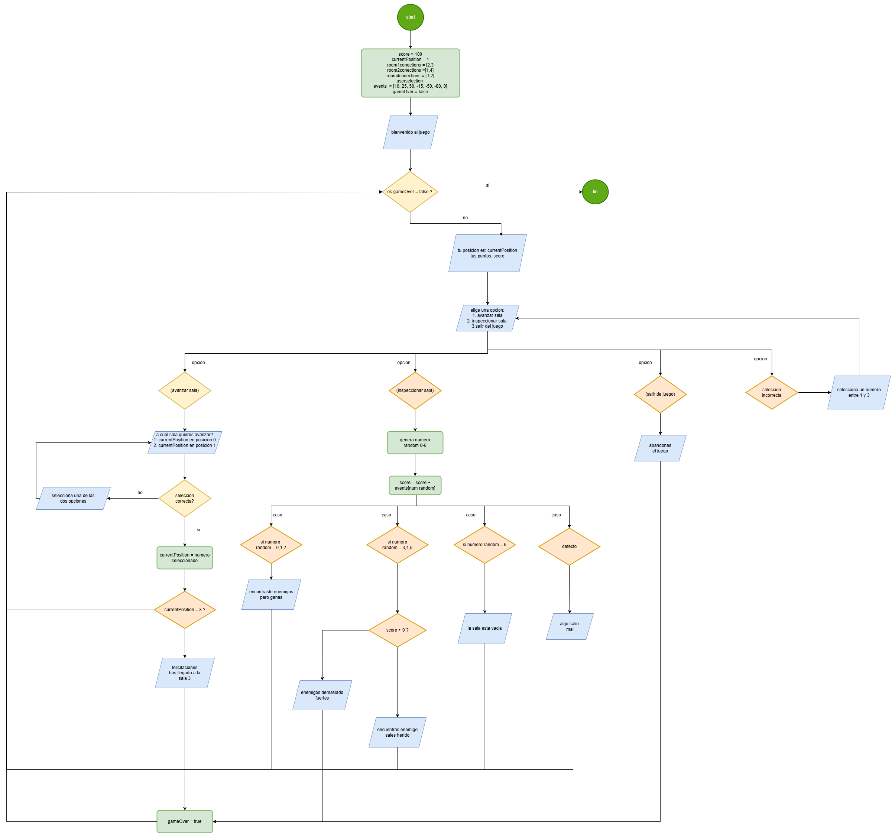

# Documentación del Proyecto: **Juego del Laberinto**

## Descripción General

El **Juego del Laberinto** es un juego interactivo en consola donde el jugador
navega entre salas conectadas, toma decisiones estratégicas y gestiona su
energía. El objetivo principal es llegar a la sala 3 con el mayor número de
puntos de energía restantes. Durante el trayecto, el jugador puede inspeccionar
salas y enfrentar eventos aleatorios que pueden afectar su energía de forma
positiva o negativa.

---

## Tabla de Contenidos

1. [Requisitos Previos](#1-requisitos-previos)
2. [Reglas del Juego](#2-reglas-del-juego)
3. [Detalles Técnicos](#3-detalles-técnicos)
4. [Estructura del Código](#4-estructura-del-código)
5. [Flujo del Programa](#5-flujo-del-programa)
6. [Diagrama de flujo](#diagrama-de-flujo)

---

### 1. Requisitos Previos

- **Java Development Kit (JDK):** Versión 8 o superior.
- **Consola de comandos:** Para ejecutar el programa.

---

### 2. Reglas del Juego

1. **Objetivo:**

   - Alcanzar la sala número 3 con puntos de energía positivos.

2. **Interacciones posibles:**

   - **Avanzar sala:** Permite al jugador moverse a una sala conectada.
   - **Inspeccionar sala:** Activa un evento aleatorio que puede aumentar o
     disminuir la energía.
   - **Salir del juego:** El jugador abandona la partida.

3. **Condiciones de fin del juego:**

   - Llegar a la sala número 3.
   - Agotar los puntos de energía.
   - Abandonar el juego.

4. **Eventos aleatorios:**
   - Los eventos pueden otorgar o restar energía al jugador dependiendo de su
     naturaleza.

---

### 3. Detalles Técnicos

- **Salas:** Las salas están conectadas de la siguiente manera:
  - Sala 1: Conexión a salas 2 y 3.
  - Sala 2: Conexión a salas 1 y 4.
  - Sala 4: Conexión a salas 1 y 2.
- **Eventos:** Los eventos afectan los puntos de energía del jugador según un
  array predefinido:

  ```java
  final int[] EVENTS = {10, 25, 50, -15, -50, -80, 0};
  ```

- **Mensajes:** Se utilizan códigos ANSI para colorear los mensajes en la
  consola:
  - Rojo (\033[31m): Advertencias o mensajes de derrota.
  - Verde (\033[32m): Mensajes positivos o de éxito.
  - Azul (\033[34m): Mensajes informativos.
  - Amarillo (\033[33m): Advertencias menores.

---

### 4. Estructura del Código

El código se divide en las siguientes secciones principales:

1. **Inicialización:**

   - Declaración de variables y constantes.
   - Configuración de las conexiones entre salas y eventos.

2. **Ciclo Principal del Juego:**

   - Se ejecuta hasta que `isGameOver` sea `true`.
   - Incluye las opciones principales: avanzar sala, inspeccionar sala, o salir
     del juego.

3. **Interacción del Usuario:**

   - Manejo de entradas con validaciones para prevenir errores.

4. **Lógica de Eventos:**

   - Selección aleatoria de un evento al inspeccionar una sala.
   - Modificación de los puntos de energía del jugador según el evento.

5. **Condiciones de Fin:**
   - Llegar a la sala 3 con energía restante.
   - Reducir la energía a 0.
   - Decidir salir del juego.

---

### 5. Flujo del Programa

1. **Inicio del Juego:**

   - Se muestra un mensaje de bienvenida.
   - La energía inicial es de 100 puntos.
   - La posición inicial es la sala 1.

2. **Selección de Acción:**

   - El jugador elige entre:
     1. Avanzar sala.
     2. Inspeccionar sala.
     3. Salir del juego.

3. **Ejecución de la Acción:**

   - Si se avanza sala, se valida la conexión.
   - Si se inspecciona sala, se ejecuta un evento aleatorio.
   - Si se sale del juego, se termina la partida.

4. **Fin del Juego:**
   - El juego finaliza mostrando un mensaje dependiendo del motivo:
     - Victoria: Llegar a la sala 3.
     - Derrota: Quedarse sin energía.
     - Abandono: Decisión del jugador.

---

## Ejemplo de Ejecución

**Consola:**

```
_________________________
|       BIENVENIDO      |
|  JUEGO DEL LABERINTO  |
-------------------------

-----------------------------
Tu energia es de 100 puntos
Estas en la sala numero 1
-----------------------------

¿Qué quieres hacer?
1. Avanzar sala.
2. Inspeccionar la sala.
3. Salir de juego.
Tu selección es: 2

Decides inspeccionar la sala.
Encontraste enemigos pero conseguiste derrotarles y robar su energía.

-----------------------------
Tu energía es de 150 puntos
```

---

## Diagrama de flujo


